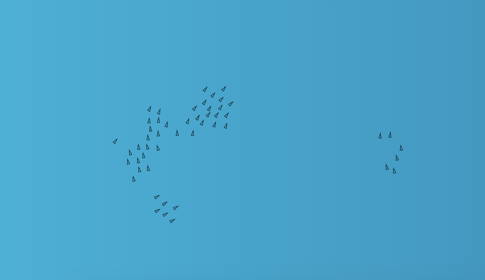

# boids-ts

> Flock simulation and boids

[](http://nkint.github.io/boids-ts/)

[(demo)](http://nkint.github.io/boids-ts/)

<!-- iframe: http://nkint.github.io/boids-ts/index.html -->

Flock simulation with _canvas_, _gl-vec2_ and _typescript_.

Code is not optimized but slavishly ported from Nature of Code ([chapter 6](https://natureofcode.com/book/chapter-6-autonomous-agents/)).
Go Daniel Shiffman, go!

For the original code see here:

- https://github.com/shiffman/The-Nature-of-Code-Examples-p5.js/tree/master/chp06_agents/NOC_6_09_Flocking
- https://github.com/shiffman/The-Nature-of-Code-Examples-p5.js/tree/master/chp06_agents/NOC_6_02_Arrive

For a - maybe better, less OOP, more optimized - boid package see [hughsk boid](https://github.com/hughsk/boids)

## Example

```js
import { Flock, Boids, heading } from 'boid-ts'

const flock = new Flock()

for (let i = 0; i < 60; i++) {
  const opts = {
    center: [0, 0],
    canvasSize: [canvasWidth, canvasHeight],

    velocity: [Math.random(), Math.random()],
    r: 3,
    maxspeed: 3,
    maxforce: 0.05,

    separationScale: 1.5,
    alignScale: 1.0,
    cohesionScale: 1.0,

    desiredSeparation: 25,
    neighborDistance: 50,
  }

  let b = new Boid(opts)
  flock.addBoid(b)
}

function loop() {
  flock.run()

  context.clearRect(0, 0, width, height)

  for (let i = 0; i < flock.boids.length; ++i) {
    const boid = flock.boids[i]
    const x = boid.position[0]
    const y = boid.position[1]
    const theta = heading(boid.velocity) + Math.PI / 2

    context.save()
    context.translate(x, y)
    context.rotate(theta)
    context.beginPath()
    context.moveTo(0, -r * 2)
    context.lineTo(-r, r * 2)
    context.lineTo(r, r * 2)
    context.closePath()
    context.stroke()
    context.restore()
  }
  requestAnimationFrame(loop)
}
requestAnimationFrame(loop)
```

## License

MIT © [nkint](https://github.com/nkint)
